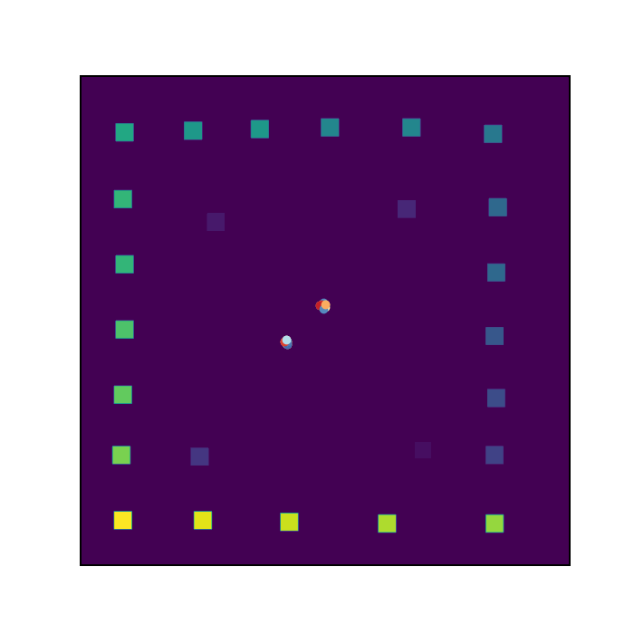
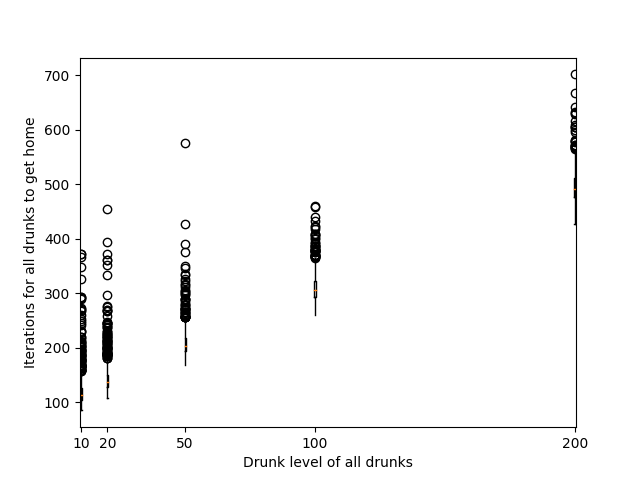

# Planning for Drunks Agent Based Model

## **[View this project on GitHub](https://github.com/tmcunningham/planning-for-drunks)**

This project simulates drunks leaving a pub and moving around an environment until they find their home. There are 25 drunks and each has an assigned house. Initially, the drunks cannot remember where they live and move randomly, but ech time they visit a location they have been to previously, they sober up slightly and eventually start moving towards their homes. The gif below shows an animation of the first 200 iterations of one instance of the model with the default parameters. Buildings are represented by squares (the pub is very faint in the centre) and drunks by dots, the colour of which represent the drunk's current ```drunk_level``` (blue is the most drunk, red is a ```drunk_level``` of 0).

Practical information on how to run the model can be found in the [README on GitHub](https://github.com/tmcunningham/planning-for-drunks/blob/master/README.md) - this page covers the intentions of the project and the development process in slightly more detail.

## Requirements

This project was completed as an assignment for the Programming for Social Science course taught by the University of Leeds in 2021. The core requirement for this assignment was to build a programme that would do the following:
- Pull in the data file and finds out the pub point and the home points.
- Draws the pub and homes on the screen.
- Models the drunks leaving their pub and reaching their homes, and stores how many drunks pass through each point on the map.
- Draws the density of drunks passing through each point on a map.
- Saves the density map to a file as text.

All of these requirements are met by the **drunk_model.py** script (which uses the **drunksframework.py** for the ```drunk``` class and **drunk_functions.py** for other functions).

## Additional improvements

As well as the basic assignment requirements, I made two major additions to the programme:

### 1. Drunks will sober up and eventually remember where their home is

Drunks have a ```drunk_level``` attribute, which determines "how drunk" they are. The drunk level decreases when they visit locations they have previously been to (the idea being that recognising a place helps them to sober up). When the ```drunk_level``` drops to a certain level, the drunk's speed increases. When the drunk completely sobers up (i.e. ```drunk_level = 0```), then the drunk will not move randomly and instead move in the direction of their house.

### 2. Drunks cannot move through buildings

To make the simulation more realistic, I stopped the drunks being able to walk through buildings. Instead, when they are at the edge of a building, they will move along the edge of it in a random direction. This was surprisingly challenging to implement.

I also created two extra files, **test_drunk_functions.py** and **measure_drunks_moves.py**, to test and analyse the code. These are discussed at the end of this page.

## Development

### Development process

The development of this project followed these stages:
- Read in the data file and finding a way to identify buildings.
- Create a drunk class along with a method to move drunks.
- Model the drunks moving in the environment and  create an animation.
- Find a way to stop drunks moving through buildings.
- Add functionality to help the drunks get home.
- Create a separate module for functions used in the project and a test module for unit tests.

I made the decision that the output of the model should be presented as an animation, as I did not see much benefit in it making use of a GUI (without significant work to give the GUI extra functionality).

### Challenges

#### Getting co-ordinates of pub and houses from raster file

The buildings were represented in the **drunk.plan** data file by numbers - 1 for the pub and then house numbers in multiples of 10 from 10 to 250 for the houses. I thought the easiest way to extract and work with the buildings would be to create a named dictionary, where the keys were the house numbers (or "pub") and the values were a list of all the co-ordinates that made up that building in the data file. To do this, I created a for loop over all the building numbers and for each iteration looped over each co-ordinate in the import of the **drunk.plan** data, adding its (x, y) position to the current building's value list if the value at that position was equal to the building number.

I used the co-ordinates to set a starting point for the drunks leaving the pub. I assumed that the pub had two doors, one in the north-east corner and one in the south-west. Each drunk is assigned just outside one of these co-ordinates (+1 x and +1 y so they didn't start inside the building) at random to start from.

#### Drunks moving around buildings

By far the most difficult part of developing the programme was stopping the drunks from walking through buildings. Initially I attempted to use an infinite while loop in the ```Drunk.move()``` method, that would set new x and y co-ordinates for the drunk within the loop and break only when the new co-ordinates were not in the set of building co-ordinates (excluding the drunk's house). However, this seemed to be too intensive and caused the programme to crash. Instead, I added an if statement after generating the new co-ordinates that checked if they were within a building (see below). If they weren't, then these co-ordinates are used as the drunk's new co-ordinates. Otherwise the drunk's co-ordinates were updated so the drunk would move perpendicular to the building (i.e., if the drunk was moving in the x direction into the building, the y co-ordinate would be updated and vice-versa).

```python
# Update x and y if they are not building co-ordinates            
if (new_x, new_y) not in self.other_building_coords:
(self.x, self.y) = new_x, new_y

# If new x coordinate is in a building, change y instead
elif (new_x, self.y) in self.other_building_coords:
    if random.random() > 0.5:
        self.y = (self.y + self.speed) % len(self.town)
    else: 
        self.y = (self.y - self.speed) % len(self.town)

# If new y coord is in a building, change x instead
elif (self.x, new_y) in self.other_building_coords:
    if random.random() > 0.5:
        self.x = (self.x + self.speed) % len(self.town)
    else: 
        self.x = (self.x - self.speed) % len(self.town)
```

#### Sober drunks getting stuck on buildings

After introducing a way to help drunks with a ```drunk_level``` of 0 to get home (by altering their y co-ordinate and then their x co-ordinate in the correct directions) and a way for drunks to move around buildings (as above), there was still an issue that sober drunks could get stuck on the side of a building on the other side of their house. This was because if the drunk was already at the same y co-ordinate as their house, the model would attempt to update the x co-ordinate but this would be in a building and so the model would change the y co-ordinate instead. In the next iteration, the y-cordinate would be changed to match the drunk's home meaning the drunk would be in the same position as the start of the iteration before. The drunk would then move back and forwards on the edge of a building indefinitely.

To fix this, I randomised the order in which the y and x co-ordinates were updated when a sober drunk (```drunk_level == 0```) was moving towards its house (see code below). While this still means there can be some moving backwards and forwards on the side of a building, eventually the randomness should mean that the drunk breaks out of this loop. Setting the drunk's ```speed``` to be higher (5 when the drunk is sober) also means there is more chance of the drunk getting around the building sooner. The random order in which the co-ordinates are updated also means that the drunks move in a staggering motion, which works well with them probably still being tipsy!

```python
# If drunk_level == 0, move drunk towards home
# Randomise whether to change x or y coord first to help with issue
# of drunks getting stuck at buildings
else:
    if random.random() < 0.5:
        if  self.front_door[1] > self.y:
            new_y = (self.y + self.speed) % len(self.town)
            new_x = self.x
        elif self.front_door[1] < self.y:
            new_y = (self.y - self.speed) % len(self.town)
            new_x = self.x
        elif self.front_door[0] > self.x:
            new_x = (self.x + self.speed) % len(self.town[0])
            new_y = self.y
        else:
            new_x = (self.x - self.speed) % len(self.town[0])
            new_y = self.y

    else:                  
        if self.front_door[0] > self.x:
            new_x = (self.x + self.speed) % len(self.town[0])
            new_y = self.y
        elif self.front_door[0] < self.x:
            new_x = (self.x - self.speed) % len(self.town[0])
            new_y = self.y 
        elif self.front_door[1] > self.y:
            new_y = (self.y + self.speed) % len(self.town)
            new_x = self.x
        else:
            new_y = (self.y - self.speed) % len(self.town)
            new_x = self.x
```

## Testing

### Test module

I created a separate test module, **test_drunk_functions.py**, for testing the model's functions and methods of the drunk class. While I created most of these tests after the functions (and I had already done some ad-hoc testing of the functions), it was helpful to know that the functions worked in the way I expected. the tests also helped me spot some minor issues - for exmaple, a string printed by the ```drunk_functions.gen_function``` function had douple spaces which meant it failed the ```TestGenFunction.test_past_iterations``` test. The test module can be run using the following line of code in the command line in the **python** directory of the project:

```
python -m unittest test_drunk_functions
```

### Comparing drunk levels

I was interested to see how the drunks' ```drunk_level``` affects the time taken for all drunks to get home and so I created a separate script (**measure_drunks_moves.py**) that would simulate the model with drunks at different ```drunk_level```s (without outputting the animation or text file), store the number of iterations it took all drunks to get home, and then plot a boxplot of the results. For each ```drunk_level``` the script ran the model 1,000 times with all of the drunks at the same ```drunk_level```. The results are shown on the boxplot below. As expected, in general, the higher the ```drunk_level```, the longer it takes all drunks to get home.



## Known issues and further work

There are no major known issues with the programme. The following areas are points to be aware of and could probably be improved with more work:
- The drunks can take a while to get around buildings (particularly the pub, which is larger than the houses) if they are sober and their house is on the other side. This depends on the direction chosen for the drunk to move in. As this choice is random, the number of iterations taken for this to resolve will vary but it should happen eventually.
- As the stopping of drunks going through buildings is done by looking at the co-ordinate that they move to rather than the path they take, if the drunk's ```speed``` was too high, they could potentially jump over buildings (including their own house). While this is not an issue for the values in the model (and ```speed``` is a protected attribute that is set automatically within the drunk class), it is worth being aware of if a user starts to chaneg the source code.

Further work on this project could include:
- Introducing a way for drunks to interact with each other (e.g., stopping to talk to one another when close enough).
- Simulating the drunks moving inside the pub until they get to one of the exits.
