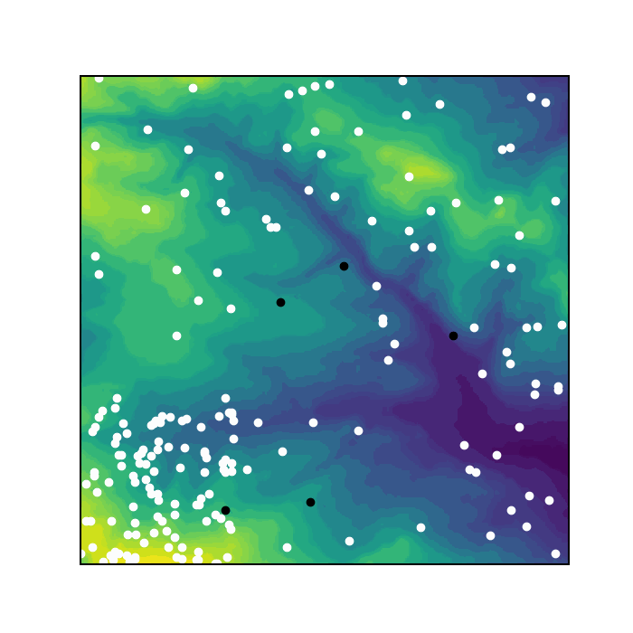

# Sheep and Wolves Agent Based Model

## **[View this project on Github](https://github.com/tmcunningham/abm)**

This project simulates sheep moving and eating grass in a field and wolves that hunt them. It was produced for the GEOG5995 Programming for Social Scientists module taught by the University of Leeds.

The model works by simulating sheep randomly moving in an environment, eating some of the environment (and adding eaten material to their personal store), throwing up if they eat too much (and adding the material back to the environment), and sharing with neighbours with less store than them. Wolves also move randomly around the environment (faster than the sheep), but will move to and eat sheep if they are within their "neighbourhood". The animation below shows the first 100 iterations of a run of the model (sheep are white and wolves are black).


Most information about how to run the model and its outputs can be [found in the GitHub README](https://github.com/tmcunningham/abm), but there were a few specific points I thought it was worth discussing in detail here.

## Sheep's starting positions

If there is an internet connection when the model is run, the x and y co-ordinates for the first 100 sheep are obtained from scraping the [data found here](https://www.geog.leeds.ac.uk/courses/computing/practicals/python/agent-framework/part9/data.html) - this means these sheep are clustered in the bottom-left corner of the field. If more than 100 sheep are required, the first 100 will still be assigned x and y co-ordinates using the web data but the co-ordinates of any additional sheep are set to be random within the field (or rather, they passed to the constructor as ```None``` which then defaults to random co-ordinates). If there is no internet connection available, all sheep's co-ordinates will be set to be random.

## Wolves' movement and eating

The wolves in the model by default move slightly faster than the sheep (3 spaces instead of 1). However, depending on the value of ```wolf_neighbourhood``` (which can be set by the user), the wolf can move significantly further than these 3 spaces if it eats a sheep. The default value of ```wolf_neighbourhood``` is 30 - that this is significantly higher than the wolf's normal speed is intended to represent the difference between a wolf aimlessly moving around a field and a wolf pursuing prey it has seen. If there multiple sheep within a wolf's neighbourhood, the wolf will eat the nearest one.

Further work on this project could involve allowing a wolf to see a sheep that it cannot reach in a single iteration and pursue this prey over multiple moves. Sheep could also respond to being pursued by running away from the wolf.

## Commented-out code

In the final_model.py script, there are several chunks of code that are commented out. Most of this is code that helped me in the process of developing the model, which I thought would be useful to submit as part of the assignment but which is not necessary (and potentially confusing) for anyone else wanting to run the model. For example, I noticed that the script could take a while to run so I timed different sections of the code to see which parts were the most time consuming. I found that the web scraping (which was initially the first thing to run) could take over 20 seconds to run. To stop the user having a long wait as soon as they started the programme, I moved this section of code to be later in the script and added a line to print "Obtaining web data..." while the process was ongoing. The code for timing the web scraping is below:
    ```python
    # Start time for scraping web data
    start_time_web = timeit.default_timer()
    
    # Try to get data from course website for first sheep xs and ys
    # If ConnectionError then set x and y lists to be empty - will be randomised
    try:
        print("Obtaining web data...")
        r = requests.get("https://www.geog.leeds.ac.uk/courses/computing/"+
                         "practicals/python/agent-framework/part9/data.html")

        # Check response is 200
        # print(r)

        # Parse HTML and read ys and xs
        soup = bs4.BeautifulSoup(r.text, "html.parser")
        td_ys = soup.find_all(attrs={"class" : "y"})
        td_xs = soup.find_all(attrs={"class" : "x"})

        # End time for scraping web data
        end_time_web = timeit.default_timer()
        print("Time taken to scrape web data: " + 
              str(end_time_web - start_time_web))
        
    except requests.exceptions.ConnectionError:
        print("Could not connect to internet. " + 
              "Defaulting to all sheep random co-ordinates.")
        td_ys = []
        td_xs = []
    ```

I also commented out some code to save a GIF of the animation (as used on this page). This took a while to run and wasn't need after I had produced one GIF, but it can be uncommented if a user wants to save a GIF. If this is the case it might be worth commenting out the tkinter code, as it can take a long time to run both sections. The code to save the animation is:
    ```python
    # Save animation as GIF
    animation = matplotlib.animation.FuncAnimation(fig, update, interval=1, 
                                                   repeat = False,
                                                   frames = gen_function(),
                                                   save_count = 100)
    print("Saving animation...\n")

    animation.save("sheep_and_wolves.gif", 
                   writer = matplotlib.animation.PillowWriter(fps = 4))

    print("Animation saved.")
    ```
