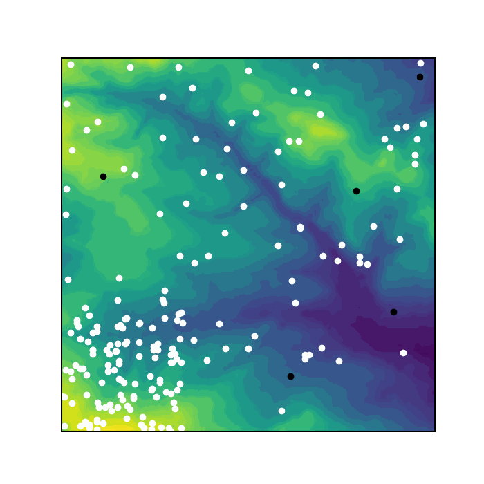

# Sheep and wolves

## **[View this project on Github](https://github.com/tmcunningham/abm)**

This project simulates sheep eating grass in a field and wolves that hunt them. It was produced for the GEOG5995 Programming for Social Scientists module taught by the University of Leeds.

